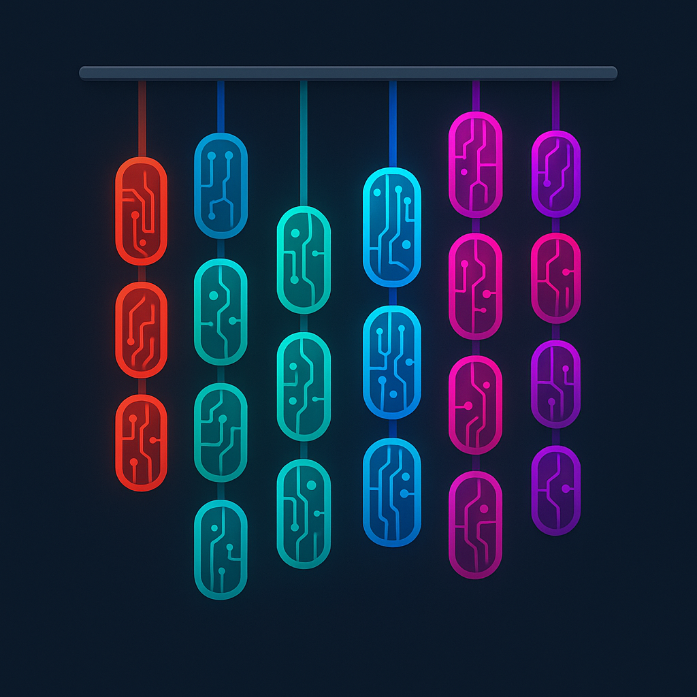

Atlantis
========

**Atlantis** is a platform for designing, running, and analyzing whole-cell
simulations of *E. coli* using the
`vEcoli <https://github.com/CovertLab/vEcoli>`_ model.

You interact with Atlantis through one of three client applications --- each
exposes the same end-to-end workflow (build a simulator, run a simulation,
download results) in a different format:

.. list-table::
   :widths: 15 35 50

   * - **CLI**
     - ``uv run atlantis``
     - Command-line interface (fastest for scripting)
   * - **TUI**
     - ``uv run atlantis tui``
     - Interactive terminal UI with sidebar navigation
   * - **Web GUI**
     - ``uv run atlantis gui``
     - Marimo notebook UI (opens in browser)

.. toctree::
   :maxdepth: 2
   :caption: Getting Started

   getting-started/installation
   getting-started/quickstart

.. toctree::
   :maxdepth: 2
   :caption: User Guide

   guides/end-to-end-workflow
   guides/choosing-a-client
   guides/cli-reference
   guides/analysis-filtering

.. toctree::
   :maxdepth: 2
   :caption: Reference

   reference/configuration
   reference/run-times

.. toctree::
   :maxdepth: 2
   :caption: Architecture (Internal)

   architecture/overview
   guides/aws-s3-setup
   guides/qumulo-setup
   architecture/aws-batch
   architecture/build-pipeline

.. toctree::
   :maxdepth: 2
   :caption: API Reference

   api/modules
